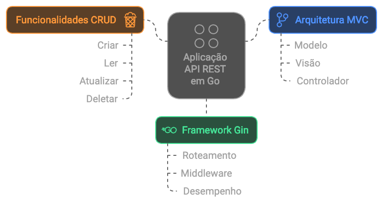

# User API - MVC Architecture in Go

## **Project Description**
This is a sample application in Go (Golang) that implements a REST API to manage users using the **MVC (Model-View-Controller)** architecture. The API was built with the **Gin** framework and offers CRUD functionalities to create, read, update and delete users, without database dependency.



The application uses a fixed list of users stored in memory for demonstration purposes. This project was organized in a modular way to facilitate scalability and maintenance.

---
## **Architecture Diagram**
The project structure follows the **MVC** architecture:

1. **Model**:
- Defines the data structures.
- Represents the domain objects (in this case, `User`).

2. **Service**:
- Contains the business logic.
- Manipulates and processes the data.

3. **Controller**:
- Manages HTTP requests.
- Invokes services and returns formatted responses.

4. **Routes**:
- Configures application routes and associates them with controllers.

---

## **Project Structure**

```plaintext
myapi/
├── controllers/ # Manages HTTP requests
│ └── user_controller.go
├── models/ # Represents application data
│ └── user.go
├── routes/ # Defines routes and associates controllers
│ └── routes.go
├── services/ # Contains business logic
│ └── user_service.go
├── main.go # Application entry point
└── go.mod # Go dependency file

```

Available Endpoints
-------
|Method | Endpoint | Description| |-------|-----------|----------|
|GET |/users |Returns all users
|GET |/users/:id |Returns a user by ID
|POST |/users |Creates a new user
|PUT |/users/:id |Updates an existing user
|DELETE |/users/:id |Removes a user by ID

## JSON Example
### User Creation (POST /users)
```json
{
"name": "John Doe",
"email": "john.doe@example.com"
}
```
### Response (201 Created)

```json
{
"id": 4,
"name": "John Doe",
"email": "john.doe@example.com"
}

```

## Technologies Used
- Go (Golang): Main language of the project.
- Gin: Lightweight framework for creating web APIs.
- MVC: Architecture adopted for separation of responsibilities.

# How to Configure and Run the Project
## 1. Prerequisites
- Install Go.
- Install Gin.

## 2. Clone the Repository

```bash
git clone https://github.com/your-repository/myapi.git
cd myapi

```

## 3. Install Dependencies
Make sure you are in the project directory and run:
```bash
go mod tidy

```

## 4. Run the Project
Start the server with the command:
```bash
go run main.go

```
The server will be available at: http://localhost:8080

# Technical Details

## Model
Location: models/user.go

Defines the data structure and the initial fixed list of users.

```go
type User struct {
ID int `json:"id"`
Name string `json:"name"`
Email string `json:"email"`
}
```

## Service
Local: services/user_service.go

Contains the business logic for managing data (e.g., fetching, creating, updating, and deleting users).

## Controller
Local: controllers/user_controller.go

Handles HTTP requests and responds to the client.

## Routes
Local: routes/routes.go

Configures API endpoints, associating them with controllers.

## Request Flow
1. The client makes an HTTP request to an API endpoint.
2. The corresponding route directs the request to the controller.
3. The controller calls the services needed to process the data.
4. The service interacts with the models and returns the data or messages.
5. The controller responds to the client with the results.

## Future Improvements
- Add database support (MySQL or PostgreSQL).
- Implement JWT authentication.
- Automated tests for services and controllers.
- Pagination support for the user list.

## License
This project is licensed under the MIT license. See the LICENSE file for more information.